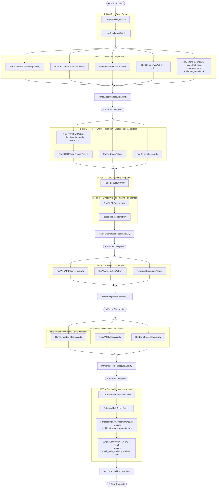

# r3ngine Temporal Scan Flow
_Full pipeline — all YAML config keys enabled_

## Execution notes

| Symbol | Meaning |
|--------|---------|
| `(( ))` | Fork / Join — marks where parallel branches split or rejoin |
| `{{"⏸ …"}}` | Pause checkpoint — workflow blocks here on a `pause` signal until `resume` |
| `─ requires …` | Node only runs when the noted YAML flag is present and true |
| Nested subgraph | `NucleiPlannerWorkflow` runs as a **child workflow** with its own independent Temporal history |

## Tier boundaries

| Tier | Parallelism | Gate into next tier |
|------|-------------|---------------------|
| Step 0 | Sequential | `LoadCheckpointActivity` |
| Tier 1 | All parallel (`asyncio.gather`) | `ParseDiscoveryResultsActivity` |
| Tier 2 | All parallel (`asyncio.gather`) | All of `ParseHTTPCrawlResults`, `RunPortScan`, `RunScreenshot` |
| Tier 3 | Sequential | `RunFetchURLActivity` |
| Tier 4 | Sequential | `ParseFuzzResultsActivity` |
| → | | `ParseEnumerationResultsActivity` |
| Tier 5 | All parallel (`asyncio.gather`) | `ParseAnalysisResultsActivity` |
| Tier 6 | All parallel (`asyncio.gather`) | `ParseAssessmentResultsActivity` |
| Tier 7 | Sequential chain | `SyncGraphActivity` |

## http_crawl — global config note

`http_crawl` runs in **Tier 2** and populates the endpoint database via `httpx`. Its results are the foundation for:
- **Tier 3** (`fetch_url`) — harvests URLs and applies GF patterns against crawled endpoints
- **Tier 4** (`dir_file_fuzz`) — fuzzes directories against the URL set built in Tiers 2–3

This is why Tiers 3 and 4 are sequential rather than parallel with Tier 2.
