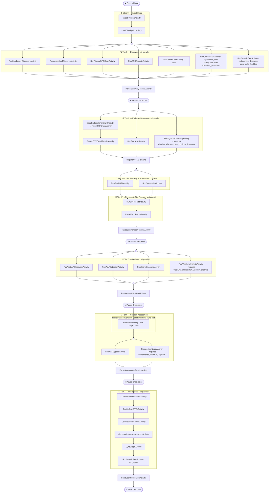

# r3ngine Temporal Scan Flow
_Full pipeline — all YAML config keys enabled_

## Execution notes

| Symbol | Meaning |
|--------|---------|
| `(( ))` | Fork / Join — marks where parallel branches split or rejoin |
| `{{"⏸ …"}}` | Pause checkpoint — workflow blocks here on a `pause` signal until `resume` |
| `─ requires …` | Node only runs when the noted YAML flag is present and true |
| Nested subgraph | `NucleiPlannerWorkflow` runs as a child workflow with its own independent Temporal history |

## Tier boundaries

| Tier | Parallelism | Gate into next tier |
|------|-------------|---------------------|
| Step 0 | Sequential | `LoadCheckpointActivity` |
| Tier 1 | All parallel (`asyncio.gather`) | `ParseDiscoveryResultsActivity` |
| Tier 2 | All parallel (`asyncio.gather`) | `ParseHTTPCrawlResultsActivity` + `RunPortScanActivity` + optional `RunVigoliumDiscoveryActivity` + tier 2 plugin dispatch |
| Tier 3 | Parallel | `RunFetchURLActivity` + `RunScreenshotActivity` |
| Tier 4 | Sequential | `ParseFuzzResultsActivity` |
| -> | | `ParseEnumerationResultsActivity` |
| Tier 5 | All parallel (`asyncio.gather`) | `ParseAnalysisResultsActivity` |
| Tier 6 | `NucleiPlannerWorkflow` first, then concurrent activities | `ParseAssessmentResultsActivity` |
| Tier 7 | Sequential chain | `CorrelateVulnerabilitiesActivity` -> `EnrichScanCVEsActivity` -> `CalculateRiskScoresActivity` -> `GenerateImpactAssessmentActivity` -> `SyncGraphActivity` -> `run_apme` |

## http_crawl dependency note

`http_crawl` runs in Tier 2 and populates the endpoint database via `httpx`. Its results directly feed:
- Tier 3 `fetch_url`
- Tier 3 `screenshot`
- Tier 4 `dir_file_fuzz`

This is why the pipeline waits for Tier 2 before continuing.

## Workflow inventory

The diagram above covers the full-scan path implemented by `MasterScanWorkflow`. The same module also defines these durable workflows:

| Workflow | Role |
|----------|------|
| `NucleiPlannerWorkflow` | Child workflow for vulnerability scanning; runs scanner stages sequentially |
| `SubScanWorkflow` | Runs one or more subdomain-scoped tasks using the same tier model |
| `StressTestWorkflow` | Sequential endpoint/tool stress execution with `kill_switch` cancellation |
| `MonitoringWorkflow` | Periodic per-domain monitoring launched by Temporal schedules |
| `ScheduledScanWorkflow` | Creates scan context, then launches `MasterScanWorkflow` as a child workflow |
| `StartupSyncWorkflow` | One-shot startup maintenance tasks such as graph sync and CVE refresh |
| `GoExecutorTaskWorkflow` | Routes heavy command execution to the dedicated Go worker queue |
| `ApmeTaskWorkflow` | On-demand attack-path modeling workflow started from the API |
| `IdentityEnrichmentWorkflow` | OSINT enrichment for names and emails |
| `GeoLocalizeWorkflow` | Geolocation enrichment for discovered IPs |
| `HackerOneImportWorkflow` | Bulk program import from HackerOne |
| `HackerOneSyncBookmarkedWorkflow` | Syncs bookmarked HackerOne programs |
| `ProxyFetchWorkflow` | Fetches and validates proxy lists in the background |
