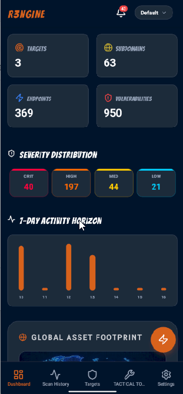
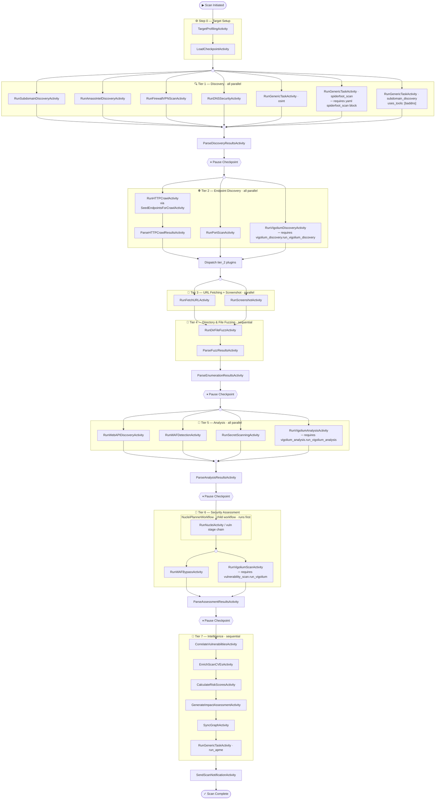
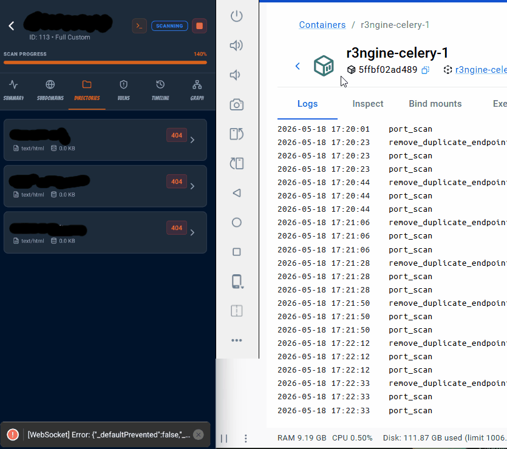

<p align="center">
  <h4 align="center"><strong>v3.6.0 is currently unstable. Please use v3.5.0 from the main branch or releases instead.</strong></h4>
</p>

<p align="center">

</p>

<p align="center">
  <h4 align="center"><strong>Phoenix: From the Ashes even Stronger</strong></h4>
  <h3 align="center">r3ngine v3 — The Ultimate Web Reconnaissance & Vulnerability Scanner</h3>
</p>

<p align="center">
  <h3 align="center">New V3 Dashboard</h3>
  
</p>

<p align="center">
  <a href="https://github.com/whiterabb17/r3ngine/releases" target="_blank">
    
  </a>
  &nbsp;
  <a href="https://www.gnu.org/licenses/gpl-3.0" target="_blank">
    
  </a>
  &nbsp;
  <a href="#" target="_blank">
    
  </a>
  <a href="https://github.com/Security-Tools-Alliance/rengine-ng" target="_blank">
    
  </a>
</p>

<h3 align="center">r3ngine 3.6.0: The Phoenix Rebirth</h3>
<p>
  r3ngine v3.6.0 is the production-stabilized, enterprise-grade evolution of the platform. Building off the original reNgine and further insired by rengine-ng (Check out <a href="https://github.com/Security-Tools-Alliance/rengine-ng" target="_blank">rengine-ng v3</a> if you haven't!) This release delivers deep <b>Neo4j graph sync</b> with CVE metadata. With a whole new metasploit plugin featuring an interactive terminal, as well as quick task delegation. Also added a new module that allows for quick enumeration and identification of vulnerable services running on discovered hosts. The infrastructure has been hardened with <b>Django 5.2.3 LTS</b>, <b>PostgreSQL 16</b>, and <b>Gunicorn + Uvicorn ASGI</b> production serving. Building on the v3.2.0 Celery → Temporal migration — which replaced the legacy at-most-once task broker with a durable workflow engine providing crash-safe execution, full replay history, and pause/resume signaling — v3.6.0 focuses on intelligence enrichment, operational security, and production reliability at scale.
</p>


<h4 align="center">Attack Path Modeling Engine</h4>
<p align="center">

</p>


<h2 align="center"><a href="https://github.com/whiterabb17/r3ngine-mobile" target="_blank">r3NgineMobileSOC</a>: Beta Release Out Now</h2>
<p align="center">

</p>

| Dashboard | Geo-Tactical Map | Scan Details | Scan Orchestration |
| :---: | :---: | :---: | :---: |
|  |  |  |  |

The r3ngine Mobile SOC companion app provides a full command-and-control interface for managing scans, reviewing findings, and monitoring targets from any device. Features include a 4-step scan wizard, plugin selector, real-time task log streaming, animated activity badge, ReconX monitoring settings, and geo-tactical map visualization.


<h2 align="center"><a href="https://github.com/whiterabb17/r3ngine-plugins" target="_blank">r3Ngine Plugins</a>: Alpha Release Out Now</h2>
<p align="center">

</p>

| Active Directory |
| :---: |
|  |

| Active Exploitation |
| :---: |
|  |

| Exploit Readiness Layer |
| :---: |
|  |

The plugin system supports dynamic installation, signed `.r3n` packages with Ed25519 verification, Temporal-wired activities, and Module Federation UI loaded directly into the host router. Available plugins include Active Directory Intelligence, Active Exploitation, Exploit Readiness Layer, Burp Suite Integration, and Email Security.


> **IMPORTANT — Upgrading from an existing installation**
>
> v3.4.1 upgraded the infrastructure stack: **Django 3.2 → 5.2.3 LTS**, **PostgreSQL 12 → 16**, and the production server changed from `runserver` to **Gunicorn + Uvicorn ASGI**. v3.2.0 replaced Celery with Temporal. Both are breaking infrastructure changes that require a full upgrade run.
>
> **You must run the full upgrade script before starting services:**
>
> ```bash
> # Linux / macOS
> git pull
> make fullupgrade
>
> # Windows
> git pull
> make.bat fullupgrade
> ```
>
> The script will:
> - Warn you of all changes and ask for explicit confirmation before proceeding
> - Stop and remove all existing containers
> - Back up the PostgreSQL database and upgrade it from pg12 → pg16 (automated, idempotent)
> - Rebuild all images from scratch with `--no-cache`
> - Apply all database migrations
> - Start the full updated stack and verify Gunicorn is serving
>
> **Your data is safe.** All Docker volumes (`scan_results`, `postgres_data`, `nuclei_templates`, `wordlist`, etc.) are fully preserved.
>
> **Do not run `make up` or `docker compose up` directly** on an existing install without running `fullupgrade` first — migrations will not be applied automatically.
>
> Any scans running at the time of upgrade **will be interrupted**. Ensure no critical scans are in progress before upgrading.


## Table of Contents

* [About r3ngine](#about-r3ngine)
* [Workflow](#workflow)
* [Project Schema](#project-schema)
* [Features](#features)
* [Quick Installation](#quick-installation)
* [Administration & Recovery](#-administration--recovery)
* [Contributing](#contributing)
* [Reporting Security Vulnerabilities](#reporting-security-vulnerabilities)
* [License](#license)


## About r3ngine

r3ngine is a production-grade web reconnaissance and vulnerability scanning platform. It combines a 7-tier scan pipeline with AI-powered intelligence gathering, graph-based attack path modeling, CVE enrichment from official threat intel feeds, and operational security controls — all orchestrated by [Temporal](https://temporal.io) for durable, crash-safe execution.

🦾&nbsp;&nbsp; **End-to-end reconnaissance** via 30+ integrated security tools: subdomain discovery, port scanning, HTTP crawling, directory fuzzing, screenshot capture, secret scanning, vulnerability assessment (Nuclei, Semgrep, WPScan, Dalfox), and more.

🗃️&nbsp;&nbsp; **Unified data model** with a custom query language. Filter reconnaissance data using natural-language operators like `http_status=200&name=admin` across all finding types.

🔧&nbsp;&nbsp; **Highly configurable scan engines** via YAML configuration. Pre-built profiles include Full Scan, Passive Scan, Screenshot Gathering, and OSINT Scan. Every parameter — threads, timeouts, rate limits — is tunable.

💎&nbsp;&nbsp; **Subscans**: respond immediately to in-progress discoveries. Launch a targeted port scan or vulnerability assessment against any subdomain without waiting for the full pipeline.

🧠&nbsp;&nbsp; **CVE Intelligence**: automatic CVSS v3.1 scoring from NVD, EPSS exploitation probability from FIRST, and CISA KEV marking — enriched on every startup and queryable via the API.

🤖&nbsp;&nbsp; **Local LLM Orchestration**: Manage your own localized Ollama Docker containers natively from the LLM Toolkit dashboard to power offline vulnerability risk assessments, mitigation strategy generation, and intelligent reporting without leaving your infrastructure.

📃&nbsp;&nbsp; **PDF Reports**: Full Scan, Vulnerability, and OSINT report types with customizable templates, executive summaries, LLM-generated impact narratives, and remediation priorities.

⚙️&nbsp;&nbsp; **Role-based access control**: Sys Admin, Penetration Tester, and Auditor roles with precisely defined permissions.


## Workflow


### Temporal Scan Pipeline (v3.2.0+)

The full scan pipeline is orchestrated by `MasterScanWorkflow` on Temporal. Every tier boundary is a hard synchronisation point — no tier starts until all activities in the previous tier have completed and their results are persisted to the database.



> `(( ))` = fork/join (parallel branch split/rejoin) &nbsp;·&nbsp; `{{"⏸"}}` = pause checkpoint (workflow waits for `resume` signal) &nbsp;·&nbsp; `─ requires` = only runs when the noted YAML flag is set
>
> Full tier reference and execution notes: [`.github/workflows/temporal-scan-flow.md`](.github/workflows/temporal-scan-flow.md)
>
> Project-wide code navigation map for contributors and AI agents: [`documents/PROJECT_SCHEMA.md`](documents/PROJECT_SCHEMA.md)

## Project Schema

`documents/PROJECT_SCHEMA.md` is a living architecture map that explains ownership boundaries, workflow inventory, request paths, and which folders usually matter for a given change.

AI-specific onboarding entrypoints are also available in `AGENTS.md`, `CLAUDE.md`, and `.cursorrules` for low-token handoff into other assistants.


## Features

### 🔬 CVE Intelligence & Enrichment (v3.5.0)
*   **CVE Enrichment Service**: Fetches CVSS v3.1 metrics from **NVD API v2.0**, exploitation probability scores from **FIRST EPSS** (synced daily via local feed), and syncs the **CISA KEV** (Known Exploited Vulnerabilities) catalog. Enriched data is cached (7-day TTL for CVEs, 1-hour for KEV) and gracefully degrades when external APIs are unavailable.
*   **Vulnerability History Tracking**: `VulnerabilityHistory` model traces vulnerabilities across historical scans, automatically classifying findings as new, persistent, or remediated.
*   **Multi-Criteria Correlation Scoring**: Composite scores using configurable tool weights, asset criticality, CISA KEV/EPSS exploitability factors, and temporal modifiers. In-scan duplicate suppression groups findings under a `group_key` before writing.
*   **Neo4j ID-Based Graph Sync**: CVE nodes in Neo4j are linked by precise CVE ID with CVSS base score and EPSS score ingested as node properties for attack path enrichment.
*   **Startup Enrichment**: On every orchestrator start, `sync_cve_data` fires 5 minutes after graph sync completes — enriching all unenriched CVEs and refreshing the KEV catalog automatically.
*   **Management Command**: `python manage.py sync_cve_data --all` for full manual synchronization.

### 🧠 Intelligence & AI Hub
*   **Centralized AI Management**: Unified interface supporting **OpenAI, Anthropic (Claude 3), Google Gemini, and local Ollama models**.
*   **Vulnerability Impact Intelligence**: Automated impact narratives, remediation strategies, and priorities via LLMs, visualized through interactive **Cytoscape.js attack paths** and a state-aware **Impact Explorer**.
*   **PII Gate Security**: Advanced privacy layer that anonymizes sensitive data (IPs, emails, hostnames) before sending to external LLMs.
*   **GPT Attack Surface Generator**: Automated generation of target profiles and high-value asset identification.
*   **Natural Language Querying**: Complex database lookups using human-like operators.

### 🛠️ Advanced Scan & Execution Engines
*   **Burp Suite Professional Integration** (v3.4.0 plugin): Two-phase Temporal sync (import → correlate), bidirectional scope push, filterable issues grid, and live connection health badge.
*   **Active Directory Intelligence Plugin**: Full AD attack surface analysis — Cytoscape.js graph with 5 layout presets, real-time WebSocket streaming (150 ms batching), paginated findings API, 7-section PDF reports (`ad_modern`, `cyber_pro` templates), and RBAC evidence logs.
*   **Attack Path Modeling Engine (APME)**: Neo4j-based graph discovery of feasible attack routes (e.g., SQLi → DB Access → Pivot) with 20+ security patterns and automated "Goal Injection".
*   **Adaptive Stress & Resilience Engine (ASRE)**: `k6`, `wrk`, `hping3`, and `Locust` orchestration with real-time ECharts telemetry via Redis Streams and WebSockets, safety kill-switches, and LLM-powered bottleneck PDF reports.
*   **Exploit Readiness Layer (ERL)**: Containerized, non-destructive vulnerability validation with native proxy rotation and OpSec compliance built into the adapter layer.
*   **Autonomous Recon Orchestration**: Temporal durable workflows with crash-safe execution, 10-attempt retry cap, full history replay at `localhost:8080`, and UI-based resume.
*   **Nmap Vulners NSE Grouped Findings**: Product-version grouped vulnerability display in UI and PDF reports with collapsed/expandable CVE sub-tables.
*   **Nuclei Sequential Severity Execution**: `NucleiPlannerWorkflow` runs severities sequentially to prevent OOM on large target sets, with per-severity activity status in the timeline.
*   **Vulnerability Correlation Engine**: Unifies findings from Nuclei, Semgrep, Trivy, Gitleaks, Acunetix, Retire.js, and more into a prioritized threat landscape with persistent state tracking.
*   **Scan Queueing**: Optional concurrency limiter (`max 1 main + 1 subscan`) with Temporal polling loop and settings panel toggle.

### 🕵️ Surgical Reconnaissance & OSINT
*   **Advanced Web API Discovery**: Kiterunner, Arjun, ParamSpider, LinkFinder, and InQL pipeline.
*   **Deep Pursuit OSINT Engine**: Email pivoting (**holehe**), cross-platform social profile mapping (**maigret**), social presence discovery (**gosearch**), tactical identity permutation (**username-anarchy**), and a **Playwright-driven LinkedIn Intelligence Engine** with session-state + cookie-vault authentication — MFA-compatible, no stored passwords, graceful scan continuation on session expiry.
*   **URL Deduplication**: Two-pass dedup after `fetch_url` — URL signature dedup (pre-save) collapses parametric variants, content-based dedup (post-save) removes duplicate HTTP responses — reducing Tier 4–6 load.
*   **Vulnerability Scanning**: Nuclei (sequential severity, auto-template updates), Semgrep (parallel downloads, 500-file cap, 5 MB per-file limit), WPScan, Dalfox (deep scan, WAF bypass, remote payloads), CRLFuzzer, S3Scanner, Gitleaks, Retire.js.
*   **Custom Parameter Discovery Engine (CPDE)**: Define custom regex and string matchers with severity levels to automatically flag undocumented or high-value parameters during crawling.
*   **WHOIS, WAF Detection, and IP Geolocation**.

### 🥷 Stealth & Operational Security (OpSec)
*   **Enhanced Proxy Orchestration**: Automated fetching, validation, and per-tool rotation of proxies across all discovery modules.
*   **Centralized Brute-Force Orchestration**: Hydra and Medusa integration with Proxychains4. Multi-service targeting: SSH, FTP, HTTP, SMB, RDP, Telnet.
*   **OpSec Presets**: User-Agent rotation, stealth timing, custom DNS resolvers, WAF bypass headers, and TOR circuit rotation.
*   **Hardened Scan Termination**: `abort_scan_history()` / `abort_subscan()` cancels all child subscans and Temporal workflows before database updates, eliminating orphaned processes.

### 🎨 Visual & Administrative Interface
*   **Cyberpunk V3 UI**: Glassmorphic dashboard — Hacker (Cyberpunk), Hybrid (Modern Dark), and Enterprise (Professional Slate) themes.
*   **Attack Surface Map v4.0**: fCoSE and KLay layouts, hierarchical asset clustering (Domains > Subdomains > Endpoints), AI-driven graph search.
*   **Tactical GeoMap Visualization**: CSS-animated markers and tooltip interactions for global asset positioning.
*   **Bounty Hub**: HackerOne program management, asset tracking, and direct vulnerability reporting.
*   **Automated Startup Sync**: On every orchestrator start — graph sync, CISA KEV catalog refresh, Semgrep rule sync, stuck scan recovery, and full CVE enrichment — all fire as one-shot Temporal schedules.
*   **Configuration Export/Import**: Backup and restore API keys, wordlists, tool configs, and scan engines to/from a single `.zip`.
*   **Scan Result Recovery**: `recover_scan_results` management command reconstructs the database from the `scan_results` volume on disk — idempotent, dry-run by default.
*   **Customizable Alerts**: Notifications via Slack, Discord, Telegram, and Lark.

### ⚡ Infrastructure & Performance
*   **Django 5.2.3 LTS** (supported until April 2028) + **PostgreSQL 16** (supported until November 2028).
*   **Gunicorn + Uvicorn ASGI**: 4-worker production server with full ASGI support for HTTP and Django Channels WebSocket streams.
*   **Temporal Workflow Engine**: Durable execution, automatic retry with configurable backoff, per-workflow cancellation.
*   **Automated Infrastructure Upgrade** (`make fullupgrade`): 8-step procedure covering DB backup, PostgreSQL major-version upgrade (idempotent), image rebuild, migration apply, and health verification.
*   **Global Redis Caching**: Unified Redis-backed caching replacing per-process local memory for shared state efficiency.
*   **Deterministic Resource Limits**: Docker `deploy.resources` limits for all production services.


## 🛠️ Development & Type Safety

The r3ngine frontend is built with a "Safety-First" philosophy under `strict: true` TypeScript throughout.

*   **Full Strict Mode**: Eliminates hidden null pointers and undefined property access at build time.
*   **Contract Integrity**: Frontend models mapped to the auto-generated OpenAPI schema (`src/types/api.ts`) with `verbatimModuleSyntax` for tree-shaking.
*   **Modular Architecture**: Feature-based structure — each module (`targets`, `scans`, `vulnerabilities`) maintains its own API hooks and types.
*   **Production Hardening**: CI/CD validates every commit against `tsc -b` and `vite build`.


## Quick Installation

### Quick Setup for Ubuntu/VPS

1. Clone the repository

    ```bash
    git clone https://github.com/whiterabb17/r3ngine && cd r3ngine
    ```

1. Configure the environment

    ```bash
    nano .env
    ```

    **Ensure you change the `POSTGRES_PASSWORD` for security.**

1. (Optional) For non-interactive install, set admin credentials in `.env`

    ```bash
    DJANGO_SUPERUSER_USERNAME=yourUsername
    DJANGO_SUPERUSER_EMAIL=YourMail@example.com
    DJANGO_SUPERUSER_PASSWORD=yourStrongPassword
    ```

1. Configure Temporal worker concurrency in `.env` (optional)

    ```bash
    TEMPORAL_MAX_CONCURRENT_ACTIVITIES=20
    TEMPORAL_MAX_CONCURRENT_WORKFLOWS=10
    ```

    Recommended values by available RAM:

    * 4 GB: `TEMPORAL_MAX_CONCURRENT_ACTIVITIES=10`
    * 8 GB: `TEMPORAL_MAX_CONCURRENT_ACTIVITIES=20`
    * 16 GB+: `TEMPORAL_MAX_CONCURRENT_ACTIVITIES=40`

    The Temporal UI is available at `http://localhost:8080` for workflow inspection, history replay, and manual intervention.

1. Run the installation script:

    ```bash
    sudo ./install.sh
    ```

    For non-interactive install: `sudo ./install.sh -n`

    *Note: If needed, run `chmod +x install.sh` first.*

**r3ngine is accessible at `https://127.0.0.1` (or your VPS IP). Do not expose via direct port access in production.**

### Installation on Other Platforms

For Mac, Windows, or other systems, refer to the installation notes in [`docker/`](docker/) or open an issue for platform-specific guidance.

## Updating

```bash
cd r3ngine && sudo ./update.sh
```

For major version upgrades (including infrastructure changes), always use `make fullupgrade` instead of a plain `docker compose up`.


## 🔧 Administration & Recovery

### Scan Result Recovery

If the database is lost or corrupted but the `scan_results` Docker volume is intact, the `recover_scan_results` management command can reconstruct the database from files on disk.

**What is recovered** (when the corresponding output files exist):

| Data | Source file(s) |
|------|----------------|
| Domain | Parsed from folder name (`domain_scanid`) |
| ScanHistory | Folder mtime used as scan date |
| Subdomains | `#id_subdomain_discovery.txt`, `subdomains_*.txt`, subscan dirs |
| Ports + IpAddresses | `#id_port_scan.txt` — naabu JSONL and legacy JSON-object formats |
| EndPoints | `#id_fetch_url.txt`, `urls_*.txt` |
| Vulnerabilities | `*_nmap_vulns.json`, `#id_nuclei_*_module.txt` |
| WAF associations | `#id_waf_detection.txt` linked to matching subdomains |

**Usage** (run inside the `web` container):

```bash
# Dry-run — preview what would be recovered without writing anything
python manage.py recover_scan_results

# Apply — write recovered records to the database
python manage.py recover_scan_results --apply

# Recover a single scan folder
python manage.py recover_scan_results --apply --scan-dir /usr/src/scan_results/example.io_108

# Use a non-default results root
python manage.py recover_scan_results --apply --results-root /alt/path/scan_results
```

```bash
docker-compose exec web python manage.py recover_scan_results --apply
```

The command is **idempotent** — scans already in the database are skipped on every run.

### CVE Data Synchronization

```bash
# Inside the web container:
python manage.py sync_cve_data              # Enrich unenriched CVEs
python manage.py sync_cve_data --kev        # Sync CISA KEV catalog only
python manage.py sync_cve_data --refresh 30 # Re-enrich CVEs from last 30 days
python manage.py sync_cve_data --all        # Full sync (KEV + unenriched)
```

CVE enrichment also runs automatically 5 minutes after every orchestrator startup.

### Debugging

1. Enable debug mode — edit `docker/web/entrypoint.sh` and add `export DEBUG=1` at the top, then `docker-compose restart web`.
2. View logs: `make logs` or `docker compose logs temporal-python-orchestrator`.
3. Temporal UI: `http://localhost:8080` — full workflow history, signals, event replay.
4. Disable debug mode when done: set `DEBUG=0` and restart.


## Screenshots

### Scan Results


### Live Logs



### Mobile Interface


## Contributing

Contributions of all sizes are welcome. Whether fixing a typo, improving UI, or adding new features — every contribution matters.

How you can contribute:
  * Code improvements and bug fixes
  * Documentation updates
  * New feature suggestions and implementations
  * UI/UX enhancements
  * Plugin development

To get started:
  1. Check our [Contributing Guide](.github/CONTRIBUTING.md)
  2. Pick an [open issue](https://github.com/whiterabb17/r3ngine/issues) or propose a new one
  3. Fork the repository and create your branch
  4. Make your changes and submit a pull request


## Submitting Issues

When submitting issues, provide as much detail as possible:

1. Enable debug mode (see [Debugging](#debugging) above)
2. Run `make logs` to capture the full stack trace
3. Check the browser developer console for XHR 500 errors
4. Submit a GitHub issue with the stack trace, reproduction steps, and system information


## Reporting Security Vulnerabilities

**Do not** disclose security vulnerabilities publicly on GitHub issues.

Go to the [Security tab](https://github.com/whiterabb17/r3ngine/security) and click **"Report a vulnerability"** to open GitHub's private vulnerability reporting form. Include:
- Steps to reproduce
- Potential impact
- Suggested fixes or mitigations (if any)

Reports are reviewed within 48–72 hours. Responsible disclosure will be publicly acknowledged after the fix is released, unless you prefer to remain anonymous.


## License

Distributed under the GNU GPL v3 License. See [LICENSE](LICENSE) for more information.


<p align="right"><i>Note: Parts of this README were written or refined using AI language models.</i></p>
