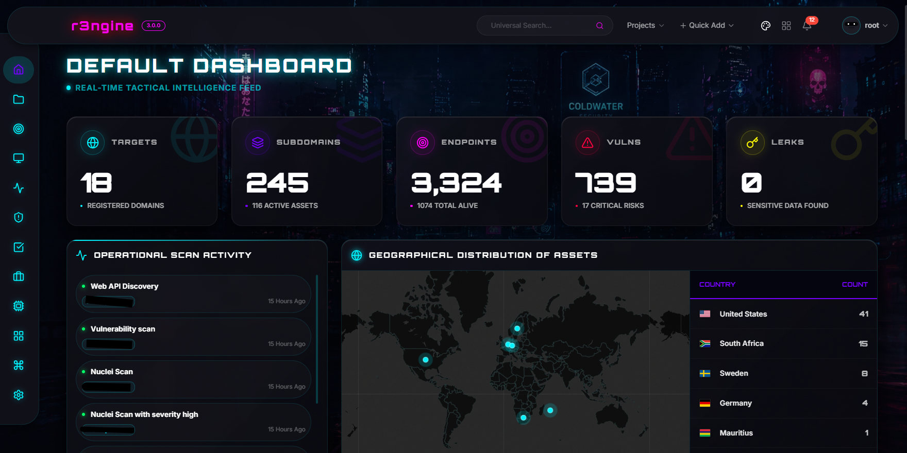
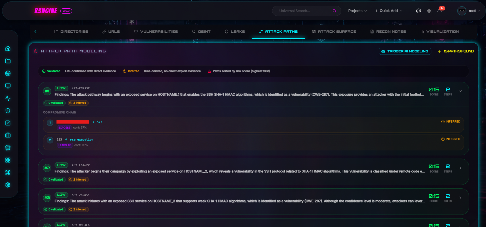
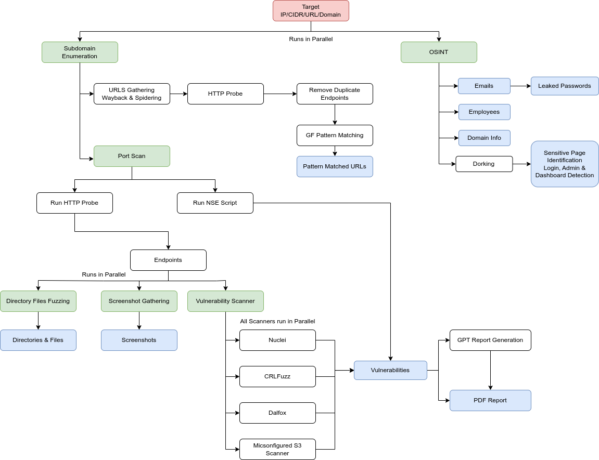
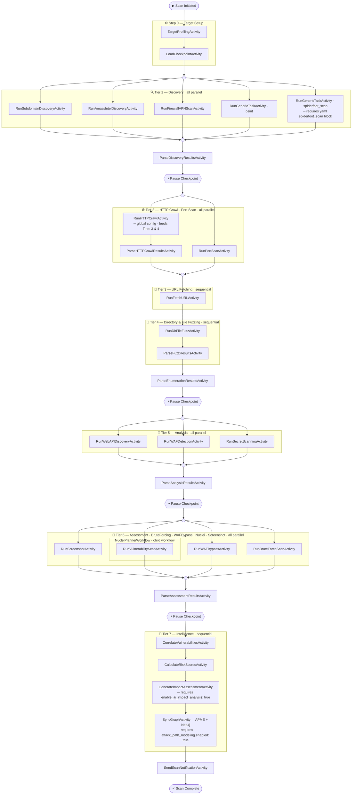

<p align="center">
  <em>V3 Beta Release is now operational!</em>
</p>
<p align="center">
<a href="https://rengine.wiki"></a>
</p>

<p align="center">
  <h4 align="center"><strong>Phoenix: Fire from the Ashes even Stronger</strong></h4> 
  <h3 align="center">Official v3 Rebirth: The Ultimate Web Reconnaissance & Vulnerability Scanner 🚀</h3>
</p>
<p align="center">
  <h3>New V3 Dashboard</h3>
</p>

<p align="center">

</p>

<p align="center"><a href="https://github.com/whiterabb17/r3ngine/releases" target="_blank"></a>&nbsp;<a href="https://www.gnu.org/licenses/gpl-3.0" target="_blank"></a>&nbsp;<a href="#" target="_blank"></a></p>

<p align="center">
  <a href="https://www.youtube.com/watch?v=Xk_YH83IQgg" target="_blank"></a>&nbsp;
  <a href="https://www.youtube.com/watch?v=Xk_YH83IQgg" target="_blank"></a>&nbsp;
  <a href="https://www.youtube.com/watch?v=Xk_YH83IQgg" target="_blank"></a>&nbsp;
  <a href="https://cyberweek.ae/2021/hitb-armory/" target="_blank"></a>&nbsp;
  <a href="https://www.youtube.com/watch?v=7uvP6MaQOX0" target="_blank"></a>&nbsp;
  <a href="https://drive.google.com/file/d/1Bh8lbf-Dztt5ViHJVACyrXMiglyICPQ2/view?usp=sharing" target="_blank"></a>&nbsp;
  <a href="https://www.youtube.com/watch?v=A1oNOIc0h5A" target="_blank"></a>&nbsp;
</p>

<!-- <p align="center">
<a href="https://github.com/whiterabb17/r3ngine/actions/workflows/codeql-analysis.yml" target="_blank"></a>&nbsp;<a href="https://github.com/whiterabb17/r3ngine/actions/workflows/build.yml" target="_blank"></a>&nbsp;
</p> -->

<p align="center">
<a href="https://opensourcesecurityindex.io/" target="_blank" rel="noopener">
 </a>
</p>
<h4>r3ngine 3.2.0: The Phoenix Rebirth</h4>
<p>
  r3ngine 3.2.0 marks the official rebirth and production stabilization of the project. This version features the new <b>Cyberpunk Phoenix</b> identity, <b>Human-in-the-Loop OSINT Staging</b>, and a <b>Reinforced Security Discovery Stack</b>. Most significantly, v3.2.0 completes the full migration from Celery to <b>Temporal</b> — replacing the legacy at-most-once task broker with a durable workflow engine that provides crash-safe scan execution, full replay history, and pause/resume signaling. Built on the massive v3.0 core, it represents a complete architectural overhaul designed for the modern threat landscape.
</p>

<h4>Attack Path Modeling Engine<h4>
<p align="center">

</p>


<h5><a href="https://github.com/whiterabb17/r3ngine-mobile" target="_blank">r3ngine Mobile SOC</a>: Beta Release Out Now</h5>


> **IMPORTANT — Upgrading to v3.2.0 from an existing installation**
>
> v3.2.0 replaces Celery with Temporal as the scan orchestration engine. This is a **breaking infrastructure change** — the old `celery` and `celery-beat` containers are removed, new `temporal`, `temporal-python-orchestrator`, and `temporal-go-executor` containers are added, and database migrations must be applied to create the new Temporal models and remove legacy Celery Beat tables.
>
> **You must run the full upgrade script before starting services:**
>
> ```bash
> # Linux / macOS
> git pull
> make fullupgrade
>
> # Windows
> git pull
> make.bat fullupgrade
> ```
>
> The script will:
> - Warn you of all changes and ask for explicit confirmation before proceeding
> - Stop and remove all existing containers (including any running `celery` / `celery-beat` services)
> - Rebuild all images from scratch with `--no-cache`
> - Apply database migrations (`TemporalWorkflowExecution`, `TemporalSchedule`, removal of `django_celery_beat_*` tables)
> - Start the full updated stack
>
> **Your data is safe.** All Docker volumes (`scan_results`, `postgres_data`, `nuclei_templates`, `wordlist`, etc.) are fully preserved. Only containers and images are rebuilt — no volume data is deleted or modified.
>
> **Do not run `make up` or `docker compose up` directly** on an existing v3.1.x install — the old Celery containers will conflict and migrations will not be applied automatically.
>
> Any scans running at the time of upgrade **will be interrupted**. Ensure no critical scans are in progress before upgrading.


## 🚀 The v3 Evolution: Comprehensive Enhancements (Since v2.2)

Version 3.0 and the preceding v2.5/2.4 cycles represent a paradigm shift in r3ngine's capabilities. From **AI-native intelligence** and **graph-based attack modeling** to the new **high-performance stress testing dashboard**, below are the core pillars of the recent evolution, detailed for security professionals who require surgical precision.

### 🧠 The Intelligence & AI Hub
r3ngine is now an AI-native reconnaissance suite, moving beyond simple tool automation to intelligent analysis.
*   **Centralized AI Hub**: A unified management interface supporting **OpenAI, Anthropic (Claude 3), Google Gemini, and local Ollama models**.
*   **Vulnerability Impact Intelligence**: Automated generation of detailed impact narratives and remediation priorities using LLMs, visualized through interactive **Cytoscape.js attack paths**. Features a seamless, state-aware **Impact Explorer** with real-time assessment monitoring and persistent synchronization to reporting models.
*   **PII Gate Security**: Advanced privacy layer that anonymizes sensitive reconnaissance data (IPs, emails, hostnames) before sending it to external LLMs, ensuring enterprise-grade data protection.
*   **Dynamic Model Discovery**: Real-time fetching of available models with hardware requirement insights for local deployments.

### 🛠️ Advanced Engine Overhaul
The core scanning engines have been upgraded to provide "Verification-First" reconnaissance.
*   **Attack Path Modeling Engine (APME)**: A production-grade, graph-based modeling system utilizing **Neo4j**. It discovers feasible attack routes (e.g., SQLi → DB Access → Pivot) based on a dynamic rules engine. **v3 Update**: Expanded rule set with 20+ sophisticated security patterns and automated "Goal Injection" for robust path discovery.
*   **Exploitation Readiness Layer (ERL)**: A safe, modular validation layer that converts potential findings into **"Verified" status** using containerized, non-destructive validation tools.
### 🌪️ Adaptive Stress & Resilience Engine (ASRE)
reNgine now features a high-performance stress testing suite, enabling users to evaluate endpoint stability and saturation limits directly from the reconnaissance workflow.
*   **Multi-Tool Orchestration**: Seamlessly execute and control `k6`, `wrk`, `hping3`, and `Locust` with synchronized backend orchestration.
*   **Real-Time Telemetry Dashboard**: A premium monitoring interface featuring synchronized **ECharts** for Latency, RPS, and Throughput, powered by low-latency **Redis Streams** and **WebSockets**.
*   **Scenario-Based Testing**: Support for headless Locust execution with dynamic scenario generation and aggregated stats parsing.
*   **Infrastructure Safety**: Integrated safety guardrails and Redis-backed kill-switch mechanisms for instant termination of high-load tests.
*   **Specialized Intelligence Reports**: High-fidelity PDF reports with performance-focused aesthetics (`stress_cyber_pro` and `stress_modern`). Includes LLM-powered bottleneck analysis, latency heatmaps, and success-rate stability charts.
*   **Vulnerability Correlation Engine**: Unifies findings from **Nuclei, Semgrep, Gitleaks, Acunetix, and Retire.js** into a prioritized threat landscape.
*   **Persistent Vulnerability State Tracking**: Automated lifecycle management that identifies vulnerabilities and their status over time.
*   **Centralized Brute-Force Orchestration**: A multi-tiered authentication attack pipeline that supports **multi-service targeting (SSH, FTP, HTTP, SMB, RDP, Telnet)**. Centralizes targets from Nmap, Nuclei, and intelligent form extraction into a unified `AuthCandidate` queue, orchestrated via **Hydra** with full OpSec controls.
*   **Autonomous Plugin Management**: A powerful, modular system to extend reNgine with custom engines and dynamic UI components. Features **Atomic Installation** with background tool installation (`tools.yaml`), automated engine registration via fixtures, and persistent startup verification.

### ⚡ Resource Management & Efficiency
Optimization is a first-class citizen in v3, ensuring high-performance reconnaissance even on resource-constrained host machines.
*   **Temporal Workflow Engine**: Replaced Celery with [Temporal](https://temporal.io) for all scan orchestration. Workflows survive container restarts, support pause/resume signaling, and provide a full execution history UI. A single `temporal-python-orchestrator` container replaces the old multi-worker sprawl, reducing base memory overhead significantly.
*   **Durable Execution**: Scan activities are automatically retried on failure with configurable backoff. No more lost scans due to worker crashes or Redis broker blips.
*   **Global Redis Caching**: Migrated from per-process local memory caching to a unified Redis-backed caching layer, ensuring shared state efficiency and reduced RAM footprint.
*   **Deterministic Resource Limits**: All production services (Temporal, Ollama, Neo4j, Web) now feature native Docker `deploy.resources` limits and reservations, preventing system-wide resource starvation.

### 🕵️ Surgical Recon & API Discovery
The reconnaissance pipeline has been deepened to handle modern, API-centric web architectures.
*   **Deep Pursuit OSINT Engine**: A modernized, high-performance intelligence pipeline that replaces heavy Spiderfoot scans with surgical discovery. Featuring **holehe** for email pivots, **maigret** for cross-platform social profile mapping, and a custom **Internal Social Intelligence Engine** for advanced LinkedIn discovery.
*   **OSINT Intelligence Dashboard**: Aggregated view of emails, leaks, employees, dorks, and document metadata.

### 🗂️ Active Directory Intelligence Plugin
r3ngine v3.2.0 introduces a dedicated **Active Directory Intelligence** plugin for internal network reconnaissance and AD attack surface analysis.
*   **Graph Visualization**: Interactive Cytoscape.js graph with 5 layout presets (hierarchical, radial, force, bipartite, cluster), semantic node styling for domain controllers, trust bridges, and exposed accounts, plus an animated real-time ingest mode.
*   **Scalability Guardrails**: Graph enforces a 300-node default cap with user-triggered "Load All"; animations automatically disable above 400 nodes to maintain UI responsiveness.
*   **Findings & Trust Enumeration**: Paginated API endpoints (50 records/page) for all AD objects — users, groups, computers, trusts, and exposures — with inline search and column-level filtering.
*   **Real-Time WebSocket Streaming**: Backend emits graph and findings events through Django Channels with 150 ms client-side batching during large LDAP/BloodHound ingests.
*   **7-Section Intelligence Reports**: `ReportingEngine` compiles executive summary, domain inventory, trust topology, exposure analysis, and recommendations into PDF (`cyber_pro`, `ad_modern` templates) or JSON exports.
*   **RBAC & Evidence Logs**: All assessment actions require `can_run_ad_assessment` permission and are written to an immutable evidence log.
*   **Subdomain-Triggered Assessment**: Launch an AD assessment directly from any subdomain record in the subdomain management table.

### 🥷 Stealth, OpSec & Infrastructure
Operational security is no longer an afterthought; it is baked into every execution.
*   **Enhanced Proxy Orchestration**: Per-tool rotating proxy support across all discovery modules to bypass rate-limiting and WAF blocks.
*   **Hardened Scan Termination**: Centralized `abort_scan_history()` / `abort_subscan()` utility ensures all child subscans and Temporal workflows are cancelled before database status is updated, eliminating orphaned workflows and stuck RUNNING scan records. Fixes applied across `StopScan`, `stop_scans`, `bulk_stop`, `delete_all_scan_results`, and `bulk_delete` endpoints.
*   **Workflow Retry Cap**: `MasterScanWorkflow` and `SubScanWorkflow` now enforce a maximum of 10 retry attempts. After 10 failures the workflow transitions to FAILED state; users can re-trigger execution via the **Resume** button which replays from the last checkpoint.
*   **Hydra & Medusa Integration**: High-performance authentication brute-forcing with automated service mapping and stealthy, batched execution via **Proxychains4**.
*   **WAF Bypass & OpSec Presets**: Advanced stealth configuration including User-Agent rotation, custom DNS resolvers, and WAF bypass headers.
*   **Automated Startup Sync**: A Redis-locked sequence ensures Attack Surface graphs and CISA KEV (Known Exploited Vulnerabilities) catalogs are synchronized immediately upon boot.

### 🎨 Premium Visual Experience
Aesthetic excellence is a core requirement of the v3 vision.
*   **Cyberpunk V3 "Neon" Dashboard**: A premium glassmorphic theme with a unified dark/neon palette optimized for complex data visualization.
    *   **Interactive Subdomain Management**: Fully wired tactical interface for on-demand **LLM Attack Surface Analysis**, targeted **Subscans**, and reconnaissance **TODO/Note management** directly from the inventory.
    *   **Scan Detail Header Reorganization**: Improved the aesthetic layout of the Scan Detail page by repositioning navigation breadcrumbs below action buttons and right-aligned the control group.
    *   **Chronological Ordering**: Standardized descending ID ordering across Scan History and Target Lists to ensure the most recent entries appear at the top.
    * 📊 **Enhanced Telemetry**: Fixed HTTP status breakdown logic to capture and visualize all response codes across assets. Resolved critical Scan Summary API stability issues by refactoring to target-wide cumulative data queries, ensuring full data visibility for rescans and historical targets.
*   **Responsive Header & Mobile Menu**: Dynamic adaptation of header actions into a high-fidelity hamburger drawer for small viewports, preserving the glassmorphic aesthetic.
*   **Multi-Tier Theme System**: Toggle between **Hacker (Cyberpunk)**, **Hybrid (Modern Dark)**, and **Enterprise (Professional Slate)** interfaces instantly.
*   **Attack Surface Map v4.0**: High-performance infrastructure visualization with **Hierarchical Asset Clustering** (Domains > Subdomains > Endpoints). Features advanced **fCoSE** and **KLay** layouts, semantic cluster management, and AI-driven graph search.
*   **Tactical GeoMap Visualization**: Custom high-performance CSS-animated markers and tooltip interactions for global asset positioning.


## Table of Contents

* [About r3ngine](#about-r3ngine)
* [Workflow](#workflow)
* [Features](#features)
* [Enterprise Support](#enterprise-support)
* [Quick Installation](#quick-installation)
* [Administration & Recovery](#-administration--recovery)
* [Installation Video](#installation-video-tutorial)
* [Community-Curated Videos](#community-curated-videos)
* [Screenshots](#screenshots)
* [What's new in reNgine](https://github.com/whiterabb17/r3ngine/releases)
* [Contributing](#contributing)
* [r3ngine Support](#r3ngine-support)
* [Support and Sponsoring](#support-and-sponsoring)
* [Reporting Security Vulnerabilities](#reporting-security-vulnerabilities)
* [License](#license)


## About reNgine

reNgine is not an ordinary reconnaissance suite; it's a game-changer! We've turbocharged the traditional workflow with groundbreaking features that ease your reconnaissance game. reNgine redefines the art of reconnaissance with highly configurable scan engines, recon data correlation, continuous monitoring, GPT powered Vulnerability Report, Project Management and role based access control etc.


🦾&nbsp;&nbsp; reNgine has advanced reconnaissance capabilities, harnessing a range of open-source tools to deliver a comprehensive web application reconnaissance experience. With its intuitive User Interface, it excels in subdomain discovery, pinpointing IP addresses and open ports, collecting endpoints, conducting directory and file fuzzing, capturing screenshots, and performing vulnerability scans. To summarize, it does end-to-end reconnaissance. With WHOIS identification and WAF detection, it offers deep insights into target domains. Additionally, reNgine also identifies misconfigured S3 buckets and find interesting subdomains and URLS, based on specific keywords to helps you identify your next target, making it a go-to tool for efficient reconnaissance.

🗃️&nbsp; &nbsp; Say goodbye to recon data chaos! reNgine seamlessly integrates with a database, providing you with unmatched data correlation and organization. Forgot the hassle of grepping through json, txt or csv files. Plus, our custom query language lets you filter reconnaissance data effortlessly using natural language like operators such as filtering all alive subdomains with `http_status=200` and also filter all subdomains that are alive and has admin in name `http_status=200&name=admin`

🔧&nbsp;&nbsp; reNgine offers unparalleled flexibility through its highly configurable scan engines, based on a YAML-based configuration. It offers the freedom to create and customize recon scan engines based on any kind of requirement, users can tailor them to their specific objectives and preferences, from thread management to timeout settings and rate-limit configurations, everything is customizable. Additionally, reNgine offers a range of pre-configured scan engines right out of the box, including Full Scan, Passive Scan, Screenshot Gathering, and the OSINT Scan Engine. These ready-to-use engines eliminate the need for extensive manual setup, aligning perfectly with reNgine's core mission of simplifying the reconnaissance process and enabling users to effortlessly access the right reconnaissance data with minimal effort.

💎&nbsp;&nbsp;Subscans: Subscan is a game-changing feature in reNgine, setting it apart as the only open-source tool of its kind to offer this capability. With Subscan, waiting for the entire pipeline to complete is a thing of the past. Now, users can swiftly respond to newfound discoveries during reconnaissance. Whether you've stumbled upon an intriguing subdomain and wish to conduct a focused port scan or want to delve deeper with a vulnerability assessment, reNgine has you covered.

📃&nbsp;&nbsp; PDF Reports: In addition to its robust reconnaissance capabilities, reNgine goes the extra mile by simplifying the report generation process, recognizing the crucial role that PDF reports play in the realm of end-to-end reconnaissance. Users can effortlessly generate and customize PDF reports to suit their exact needs. Whether it's a Full Scan Report, Vulnerability Report, or a concise reconnaissance report, reNgine provides the flexibility to choose the report type that best communicates your findings. Moreover, the level of customization is unparalleled, allowing users to select report colors, fine-tune executive summaries, and even add personalized touches like company names and footers. With GPT and LLM integration, your reports aren't just a report; with Assessment Overviews, Executive Briefs, Final Conclusions, remediation steps, and impacts, you get a 360-degree view of the vulnerabilities you've uncovered.

🔖&nbsp; &nbsp; Say Hello to Projects! reNgine 3.0 introduces many many more powerful additions to really boost your recon experience. Checkout all the features below. 

⚙&nbsp; &nbsp; Roles and Permissions! In reNgine 3.0, we've taken your web application reconnaissance to a whole new level of control and security. Now, you can assign distinct roles to your team members—Sys Admin, Penetration Tester, and Auditor—each with precisely defined permissions to tailor their access and actions within the reNgine ecosystem.

  - 🔐 Sys Admin: Sys Admin is a superuser that has permission to modify system and scan related configurations, scan engines, create new users, add new tools etc. Superuser can initiate scans and subscans effortlessly.
  - 🔍 Penetration Tester: Penetration Tester will be allowed to modify and initiate scans and subscans, add or update targets, etc. A penetration tester will not be allowed to modify system configurations.
  - 📊 Auditor: Auditor can only view and download the report. An auditor can not change any system or scan related configurations nor can initiate any scans or subscans.

🧭&nbsp;&nbsp;**Continuous Monitoring**: r3ngine's automated monitoring engine ensures your targets are under constant scrutiny. Schedule scans at regular intervals and receive real-time alerts via Discord, Slack, and Telegram for new subdomains, vulnerabilities, or asset changes.

⚡&nbsp;&nbsp;**Adaptive Stress & Resilience Engine (ASRE)**: r3ngine v3 introduces the **Adaptive Stress & Resilience Engine (ASRE)**, a production-grade endpoint testing suite designed to evaluate the stability and resilience of target infrastructure. Unlike traditional scanners, ASRE orchestrates high-performance tools like `k6`, `wrk`, `hping3`, and `Locust` directly within your reconnaissance workflow. It provides real-time telemetry ingestion into the Attack Surface Graph (Neo4j), allowing you to visualize how endpoints behave under load and identify potential bottlenecks or denial-of-service vulnerabilities before they become critical failures.


## Workflow



### Temporal Scan Pipeline (v3.2.0)

The full scan pipeline is orchestrated by `MasterScanWorkflow` on Temporal. Every tier boundary is a hard synchronisation point — no tier starts until all activities in the previous tier have completed and their results are persisted to the database.



> `(( ))` = fork/join (parallel branch split/rejoin) &nbsp;·&nbsp; `{{"⏸"}}` = pause checkpoint (workflow waits for `resume` signal) &nbsp;·&nbsp; `─ requires` = only runs when the noted YAML flag is set
>
> Full tier reference and execution notes: [`.github/workflows/temporal-scan-flow.md`](.github/workflows/temporal-scan-flow.md)


## Features

### 🧠 Intelligence & AI Hub
*   **Centralized AI Management**: Unified interface for OpenAI, Anthropic, Gemini, and local Ollama models.
*   **Vulnerability Impact Intelligence**: AI-generated impact narratives, remediation strategies, and tactical reports.
*   **GPT Attack Surface Generator**: Automated generation of target profiles and high-value asset identification.
*   **PII Gate Security**: Native anonymization of sensitive reconnaissance data before LLM processing.
*   **Natural Language Querying**: Perform complex database lookups using intuitive, human-like operators.

### 🛠️ Advanced Scan Engines
*   **Active Directory Intelligence**: Full AD attack surface analysis plugin with Cytoscape graph visualization (5 layouts), trust enumeration, exposure analysis, 7-section PDF/JSON reports, real-time WebSocket streaming, and RBAC-gated evidence logs.
*   **Attack Path Modeling Engine (APME)**: Sophisticated graph-based visualization of multi-stage attack vectors using Neo4j and AI-driven path discovery.
*   **Adaptive Stress & Resilience Engine (ASRE)**: High-performance real-time stress testing dashboard integrated with `k6`, `wrk`, `hping3`, and `Locust` for endpoint saturation analysis.
*   **Exploit Readiness Layer (ERL)**: Hardened automated vulnerability verification system with multi-scanner support and stealthy OpSec guardrails.
*   **Autonomous Recon Orchestration**: Temporal-powered durable workflow pipeline with non-blocking orchestration, crash-safe execution, full replay history, and a 10-attempt retry cap (FAILED workflows are resumable via the UI).
*   **Vulnerability Correlation Engine**: Multi-tool unification mapping findings from Nuclei, Semgrep, Trivy, Gitleaks, Acunetix, and more.
*   **Autonomous Tooling & Plugin System**: Background tool management ensures all plugin dependencies (e.g., sqlmap, XSStrike) are installed and verified automatically at runtime. **v3-Hardening**: Integrated native **proxy rotation** and **OpSec compliance** (User-Agent randomization, custom headers) directly into the ERL adapter layer, ensuring stealthy validation of all discovered vulnerabilities.
*   **Continuous Monitoring**: Periodic discovery of new subdomains, endpoints, and data changes with automated diffing.

### 🕵️ Surgical Reconnaissance
*   **Advanced Web API Discovery**: Dedicated pipeline featuring Kiterunner, Arjun, ParamSpider, LinkFinder, and InQL.
*   **Deep OSINT 2.0**: A modular, internal intelligence pipeline featuring automated email pivoting, social profile mapping, **gosearch** for social presence discovery, **username-anarchy** for tactical identity permutation, and a **Custom Playwright-driven Social Intelligence Engine** that mimics human behavior to discover corporate personnel while maintaining high OpSec.
*   **ReconX 24/7 Monitoring**: Dedicated, domain-specific background monitoring engine for continuous asset tracking and automated findings ingestion.
*   **Vulnerability Scanning**:
    *   **Nuclei**: Specialized templates and intelligence-driven targeted scanning.
    *   **Semgrep**: Automated static analysis for discovered endpoints (JS, PHP, Env, etc.) with automated rule synchronization (OWASP Top 10, Secrets).
    *   **WPScan**: Automated WordPress reconnaissance and vulnerability identification.
    *   **baddns**: Automated subdomain takeover detection with critical severity mapping.
    *   **betterleaks**: High-precision secret and leak identification in discovered assets.
    *   **Dalfox**: Advanced XSS discovery.
    *   **CRLFuzzer, S3Scanner, Gitleaks, Retire.js**.
*   **WHOIS, WAF Detection, and IP Geolocation**.

### 🥷 Stealth & Operational Security
*   **Enhanced Proxy Orchestration**: Automated fetching, validation, and per-tool rotation of high-quality proxies.
*   **Brute-Force Engines**: High-performance Hydra and Medusa integration with Proxychains4, **multi-service orchestration (SSH, FTP, HTTP, SMB, RDP, Telnet)**, automated service mapping (e.g., http → http-get), and configurable `max_retries` to ensure scan resilience.
*   **OpSec Presets**: User-Agent rotation, stealth timing, and WAF bypass headers.
*   **Metadata Stripping**: Automated removal of sensitive information from discovered assets.

### 🎨 Visual & Administrative
*   **Cyberpunk V3 UI**: Premium glassmorphic dashboard with Hacker, Hybrid, and Enterprise themes.
*   **Attack Surface Map v4.0**: Interactive, high-fidelity infrastructure visualization with node analytics.
*   **Interactive Subdomain Action Interface**: Real-time management for subdomains, subscans, and TODOs.
*   **Bounty Hub**: Centralized platform for managing HackerOne programs and assets.
*   **Automated Startup Sync**: Immediate synchronization of Attack Surface graphs and CISA KEV intelligence.
*   **Target Deletion API**: Resolved a critical 404 error during target deletion by synchronizing the frontend request with the correct backend orchestration endpoint.
*   **Onboarding Authentication Resilience**: Resolved a critical `TypeError` that caused the application to crash when unauthenticated users accessed the onboarding page.
*   **Customizable Alerts**: Notifications via Slack, Discord, Telegram, and Lark.
*   **HackerOne Integration**: Direct reporting of vulnerabilities to bug bounty platforms.
*   **Screenshot Gallery**: Automated visual captures with advanced filtering and tagging.
*   **Export/Import**: Interoperable with other tools via JSON, CSV, and TXT.
*   **Configuration Portability**: Export your custom API keys, tool configurations, scan engines, and wordlists to a single backup zip, and effortlessly restore them on a fresh installation.
*   **Integrated Tools**: Chaos, TLSX, CTFR, Netlas, Katana, Medusa, baddns, betterleaks, gosearch, username-anarchy.


## 🛠️ Development & Strict Type Safety

The r3ngine v3 frontend is built with a "Safety-First" philosophy, enforcing strict TypeScript constraints to ensure production reliability.

*   **Full Strict Mode**: The entire React codebase compiles under `strict: true`, eliminating hidden null pointers and undefined property access at build time.
*   **Contract Integrity**: Frontend models are strictly mapped to the auto-generated OpenAPI schema (`src/types/api.ts`). We enforce `verbatimModuleSyntax` to optimize build-time tree shaking and ensure type-only imports are explicitly marked.
*   **Modular Architecture**: Following a feature-based structure, each module (`targets`, `scans`, `vulnerabilities`) maintains its own API hooks and types, inheriting from the global contract while providing specialized UI adaptations.
*   **Production Hardening**: Our CI/CD pipeline validates every commit against `tsc -b` and `vite build`. We prioritize type-safe UI components over loose `any` declarations, utilizing safe type guards and defensive casting for robust API integration.


## Quick Installation

### Quick Setup for Ubuntu/VPS

1. Clone the repository

    ```bash
    git clone https://github.com/whiterabb17/r3ngine && cd r3ngine
    ```

1. Configure the environment

    ```bash
    nano .env
    ```

    **Ensure you change the `POSTGRES_PASSWORD` for security.**

1. (Optional) For non-interactive install, set admin credentials in `.env`

    ```bash
    DJANGO_SUPERUSER_USERNAME=yourUsername
    DJANGO_SUPERUSER_EMAIL=YourMail@example.com
    DJANGO_SUPERUSER_PASSWORD=yourStrongPassword
    ```
    If you need to carry out a non-interactive installation, you can setup the login, email and password of the web interface admin directly from the .env file (instead of manually setting them from prompts during the installation process). This option can be interesting for automated installation (via ansible, vagrant, etc.).

    * `DJANGO_SUPERUSER_USERNAME`: web interface admin username (used to login to the web interface).

    * `DJANGO_SUPERUSER_EMAIL`: web interface admin email.

    * `DJANGO_SUPERUSER_PASSWORD`: web interface admin password (used to login to the web interface).

1. Configure Temporal worker concurrency in `.env` (optional)

    ```bash
    TEMPORAL_MAX_CONCURRENT_ACTIVITIES=20
    TEMPORAL_MAX_CONCURRENT_WORKFLOWS=10
    ```

    r3ngine v3.2.0 uses [Temporal](https://temporal.io) for all scan orchestration. The `temporal-python-orchestrator` container runs a single worker that polls for workflow and activity tasks. Concurrency is controlled by the variables above; the defaults are sensible for most machines.

    Recommended values by available RAM:

    * 4GB: `TEMPORAL_MAX_CONCURRENT_ACTIVITIES=10`
    * 8GB: `TEMPORAL_MAX_CONCURRENT_ACTIVITIES=20`
    * 16GB+: `TEMPORAL_MAX_CONCURRENT_ACTIVITIES=40`

    The Temporal UI is available at `http://localhost:8080` for workflow inspection, history replay, and manual intervention.

1. Run the installation script:

    ```bash
    sudo ./install.sh
    ```

    For non-interactive install: `sudo ./install.sh -n`

    *Note: If needed, run `chmod +x install.sh` to grant execution permissions.*

**reNgine can now be accessed from <https://127.0.0.1> or if you're on the VPS <https://your_vps_ip_address>**

**Unless you are on development branch, please do not access reNgine via any ports**

### Installation on Other Platforms

For Mac, Windows, or other systems, refer to our detailed installation guide [https://reNgine.wiki/install/detailed/](https://reNgine.wiki/install/detailed/)

### Installation Video Tutorial

If you encounter any issues during installation or prefer a visual guide, one of our community members has created an excellent installation video for Kali Linux installation. You can find it here: [https://www.youtube.com/watch?v=7OFfrU6VrWw](https://www.youtube.com/watch?v=7OFfrU6VrWw)

Please note: This is community-curated content and is not owned by reNgine. The installation process may change, so please refer to the official documentation for the most up-to-date instructions.

## Updating

1. To update reNgine, run:

    ```bash
    cd r3ngine &&  sudo ./update.sh
    ```

    If `update.sh` lacks execution permissions, use:

    ```bash
    sudo chmod +x update.sh
    ```


## 🔧 Administration & Recovery

### Scan Result Recovery

If the database is lost or corrupted but the `scan_results` Docker volume is intact, the `recover_scan_results` management command can reconstruct the database from the files on disk.

**What is recovered** (when the corresponding output files exist):

| Data | Source file(s) |
|------|----------------|
| Domain | Parsed from folder name (`domain_scanid`) |
| ScanHistory | Folder mtime used as scan date |
| Subdomains | `#id_subdomain_discovery.txt`, `subdomains_*.txt`, subscan dirs |
| Ports + IpAddresses | `#id_port_scan.txt` — naabu JSONL and legacy JSON-object formats |
| EndPoints | `#id_fetch_url.txt`, `urls_*.txt` |
| Vulnerabilities | `*_nmap_vulns.json`, `#id_nuclei_*_module.txt` |
| WAF associations | `#id_waf_detection.txt` linked to matching subdomains |

**Usage** (run inside the `web` container):

```bash
# Dry-run — preview what would be recovered without writing anything
python manage.py recover_scan_results

# Apply — write recovered records to the database
python manage.py recover_scan_results --apply

# Recover a single scan folder
python manage.py recover_scan_results --apply --scan-dir /usr/src/scan_results/defijn.io_108

# Use a non-default results root
python manage.py recover_scan_results --apply --results-root /alt/path/scan_results
```

**Docker Compose shortcut:**

```bash
docker-compose exec web python manage.py recover_scan_results --apply
```

The command is **idempotent** — scans already tracked in the database are skipped on every run, so it is safe to re-run after partial recoveries.


## Community-Curated Videos

reNgine has a vibrant community that often creates helpful content about installation, features, and usage. Below is a collection of community-curated videos that you might find useful. Please note that these videos are not official reNgine content, and the information they contain may become outdated as reNgine evolves.

Always refer to the official documentation for the most up-to-date and accurate information. If you've created a video about reNgine and would like it featured here, please send a pull request updating this table.

| Video Title | Language | Publisher | Date | Link |
|-------------|----------|----------|------|------|
| reNgine Installation on Kali Linux | English | Secure the Cyber World | 2024-02-29 | [Watch](https://www.youtube.com/watch?v=7OFfrU6VrWw) |
| Resultados do ReNgine - Automação para Recon | Portuguese | Guia Anônima | 2023-04-18 | [Watch](https://www.youtube.com/watch?v=6aNvDy1FzIM) |
| reNgine Introduction | Moroccan Arabic | Th3 Hacker News Bdarija | 2021-07-27 | [Watch](https://www.youtube.com/watch?v=9FuRrcmWgWU) |
| Automated recon? ReNgine - Hacker Tools | English | Intigriti | 2021-08-24 | [Watch](https://www.youtube.com/watch?v=vP7tBopQSEc) |

We appreciate the community's contributions in creating these resources.


## Screenshots

### Scan Results


### General Usage


### Initiating Subscan


### Recon Data filtering


### Report Generation


### Toolbox


### Adding Custom tool in Tools Arsenal


## Contributing

We welcome contributions of all sizes! The open-source community thrives on collaboration, and your input is invaluable. Whether you're fixing a typo, improving UI, or adding new features, every contribution matters.

How you can contribute:
  * Code improvements
  * Documentation updates
  * Bug reports and fixes
  * New feature suggestions and implementations
  * UI/UX enhancements

To get started:

  1. Check our [Contributing Guide](.github/CONTRIBUTING.md)
  2. Pick an [open issue](https://github.com/whiterabb17/r3ngine/issues) or propose a new one
  3. Fork the repository and create your branch
  4. Make your changes and submit a pull request

Remember, no contribution is too small. Your efforts help make reNgine better for everyone!


## Submitting issues

When submitting issues, provide as much valuable information as possible to help developers resolve the problem quickly. Follow these steps to gather detailed debug information:

1. Enable Debug Mode:
   - Edit `web/entrypoint.sh` in the project root
   - Add `export DEBUG=1` at the top of the file:
     ```bash
     #!/bin/bash

     export DEBUG=1

     python3 manage.py migrate
     python3 manage.py runserver 0.0.0.0:8000

     exec "$@"
     ```
   - Restart the web container: `docker-compose restart web`

2. View Debug Output:
   - Run `make logs` to see the full stack trace
   - Check the browser's developer console for XHR requests with 500 errors

3. Example Debug Output:
    ```
    web_1          | TypeError: run_command() got an unexpected keyword argument 'echo'
    web_1          |   File "/usr/src/app/reNgine/tasks.py", line 42, in run_command
    web_1          |     subprocess.run(cmd, **kwargs)
    ```

4. Submit Your Issue:
    - Include the full stack trace in your GitHub issue
    - Describe the steps to reproduce the problem
    - Mention any relevant system information

5. Disable Debug Mode:
    - Set `DEBUG=0` in `web/entrypoint.sh`
    - Restart the web container

By providing this detailed information, you significantly help developers identify and fix issues more efficiently.


## First-time Open Source contributors

reNgine is an open-source project that welcomes contributors of all experience levels, including beginners. If you've never contributed to open source before, we encourage you to start here!

* We're proud to support your first Pull Request (PR)
* Check our [open issues](https://github.com/whiterabb17/r3ngine/issues) for starter-friendly tasks
* Don't hesitate to ask questions in our community channels

Your contribution, no matter how small, is valuable to us.


## reNgine Support

Before seeking support:

* Please carefully read the README and documentation at [rengine.wiki](https://rengine.wiki).
* Most common questions and issues are addressed there.

If you still need assistance:

* Do not use GitHub issues for support requests.
* Join our [community-maintained Discord channel](https://discord.gg/azv6fzhNCE).

Please note:
* The Discord channel is maintained by the community.
* While we strive to help, there's no guarantee of support or response time.
* For confirmed bugs or feature requests, consider opening a GitHub issue.


## Support and Sponsoring

reNgine is a passion project developed in my free time, alongside my day job. Your support helps keep this project alive and growing. Here's how you can contribute:

* Add a [GitHub Star](https://github.com/whiterabb17/r3ngine) to the project.
* Share about reNgine on social media or in blog posts
* Nominate me for [GitHub Stars?](https://stars.github.com/nominate/)
* Use my [DigitalOcean referral link](https://m.do.co/c/e353502d19fc) to get $100 credit (I receive $25)

Your support, whether through donations or simply giving a star, tells me that reNgine is valuable to you. It motivates me to continue improving and adding features to make reNgine the go-to tool for reconnaissance.

Thank you for your support!


## Reporting Security Vulnerabilities

We appreciate your efforts to responsibly disclose your findings and will make every effort to acknowledge your contributions.

To report a security vulnerability, please follow these steps:

1. **Do Not** disclose the vulnerability publicly on GitHub issues or any other public forum.

2. Go to the [Security tab](https://github.com/whiterabb17/r3ngine/security) of the reNgine repository.

3. Click on "Report a vulnerability" to open GitHub's private vulnerability reporting form.

4. Provide a detailed description of the vulnerability, including:
   - Steps to reproduce
   - Potential impact
   - Any suggested fixes or mitigations (if you have them)

5. I will review your report and respond as quickly as possible, usually within 48-72 hours.

6. Please allow some time to investigate and address the vulnerability before disclosing it to others.

We are committed to working with security researchers to verify and address any potential vulnerabilities reported to us. After fixing the issue, we will publicly acknowledge your responsible disclosure, unless you prefer to remain anonymous.

Thank you for helping to keep reNgine and its users safe!


## License

Distributed under the GNU GPL v3 License. See [LICENSE](LICENSE) for more information.


<p align="right"><i>Note: Parts of this README were written or refined using AI language models.</i></p>
